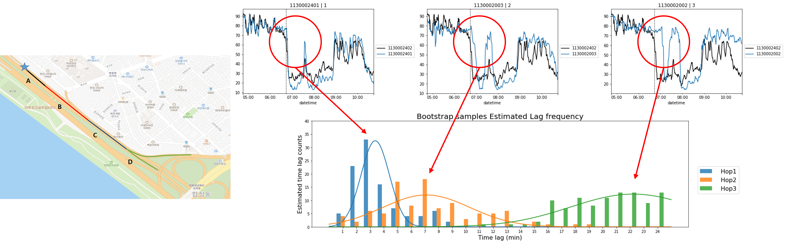

# [Time Delay Estimation of Traffic Congestion Propagation based on Transfer Entropy](https://yongkyung-oh.github.io/TransferEntropy-Propagation/)
(Working) YongKyung Oh, JiIn Kwak, Juyeong Lee and SungIl Kim, **Time Delay Estimation of Traffic Congestion Based on Statistical Causality**

Corresponding author: SungIl Kim (sungil.kim@unist.ac.kr)

## Abstract
Obtaining accurate time delay estimates is important in traffic congestion analysis because they can be used to address fundamental questions regarding the origin and propagation of traffic congestion. However, estimating the exact time delay during congestion is a challenge owing to the complex propagation process between roads and high uncertainty regarding the future behavior of the process. To aid in accurate time delay estimation during congestion,} we propose a novel time delay estimation method for the propagation of traffic congestion due to traffic accidents using lag-specific transfer entropy (TE). Nonlinear normalization with a sliding window is used to effectively reveal the causal relationship between the source and target time series in calculating the TE. Moreover, Markov bootstrap techniques were adopted to quantify the uncertainty in the time delay estimator. To the best of our knowledge, the proposed method is the first to estimate the time delay based on the causal relationship between adjacent roads. The proposed method was validated using simulated data as well as real user trajectory data obtained from a major GPS navigation system applied in South Korea.



## Prerequisite

### RTransferEntropy
When calculating transferentropy, we use R package '[RTransferEntropy](https://github.com/cran/RTransferEntropy)'
```R
install.packages("RTransferEntropy")
```

### rpy2
R package is binded with python using '[rpy2](https://github.com/rpy2/rpy2)'
```python
pip install rpy2
```


## Tutorial code 
`core` contains key functions to estimate time lag with transfer entropy and bootstrap,

```python
get_boot(x, y, lag=None, n_boot=100, plot=True, title=None, raw=None, save=None, curve=None):
'''
    x,y: source and target time series 
    n_boot: the number of bootstrap
    plot: bool, return figure output
    title: figure title
    raw: comparison value (e.g. raw value without normalization)
    save: figure save path
    curve: if true, return fitted curve info
'''
```

function `get_boot` return bootstrap estimation of time lag between two time series with organized plot,


We can estimate the mean and standard deviation of estimate time lag distribution using Bootstrap.
Simulation data and tutorial code is included '[Simulation](https://github.com/yongkyung-oh/TE-propagation/blob/main/Simulation.ipynb)'.


## Real data example
Suggested algorithm can be applied multi-hop path in the traffic network as follow 


In this case there are 5 paths exist:
- path 1: [A, B, C, D]
<p align="center"></p>

- path 2: [A, E, F, G]
<p align="center"></p>

- path 3: [A, H, I, J]
<p align="center"></p>

- path 4: [A, H, K, M]
<p align="center"></p>

- path 5: [A, H, K, L]
<p align="center"></p>


## Reference
```
Behrendt, S., Dimpfl, T., Peter, F. J., & Zimmermann, D. J. (2019). RTransferEntropy—Quantifying information flow between different time series using effective transfer entropy. SoftwareX, 10, 100265.
```
