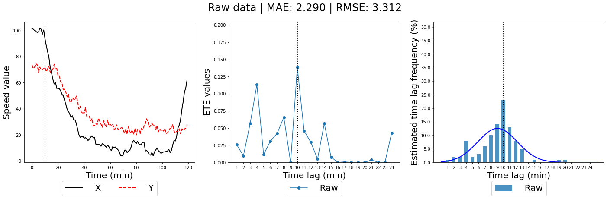
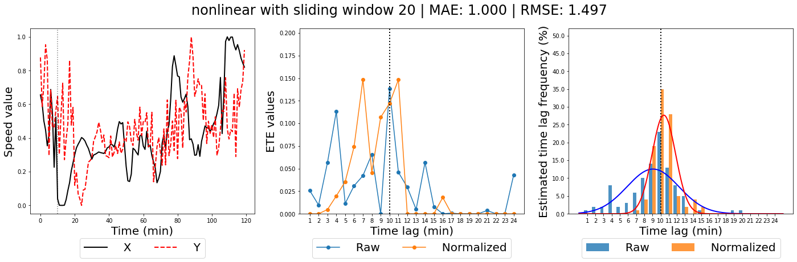
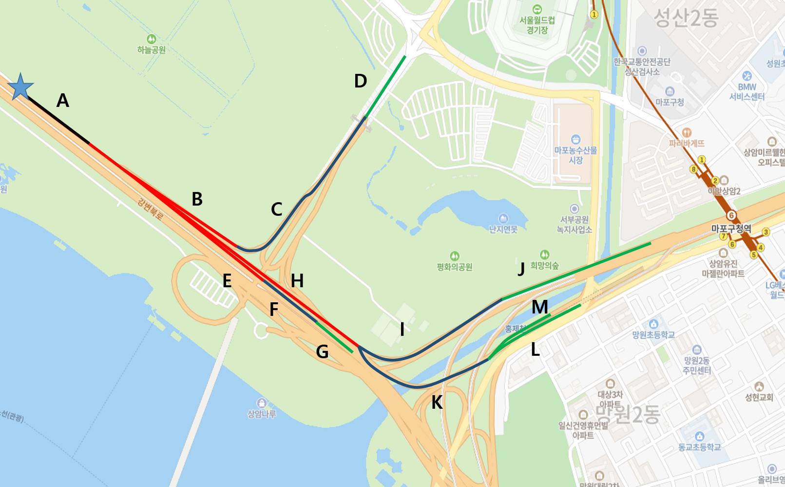
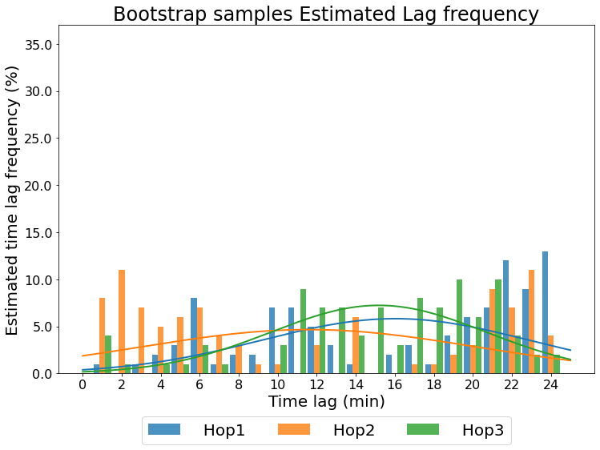
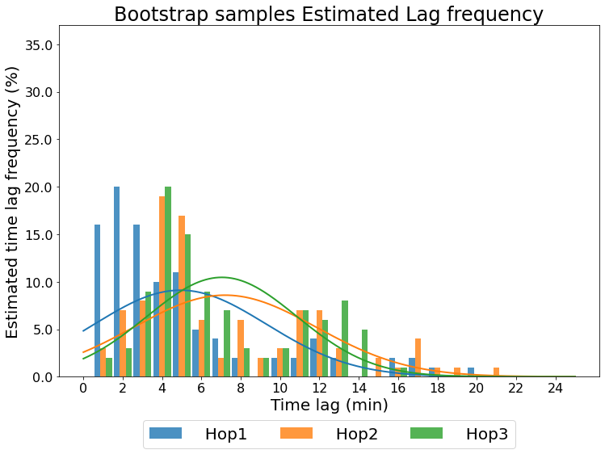
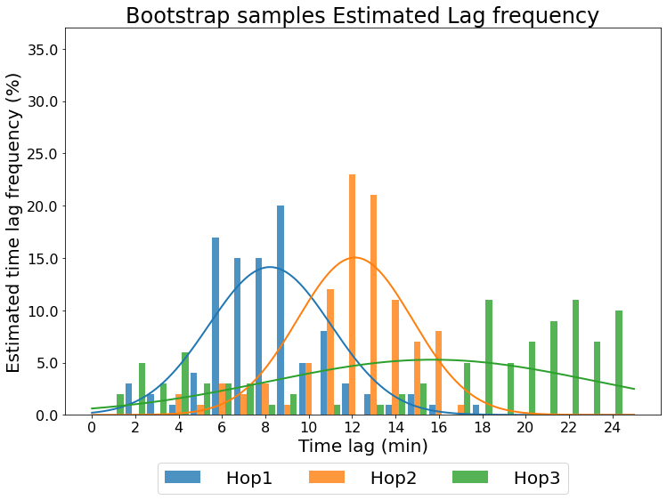
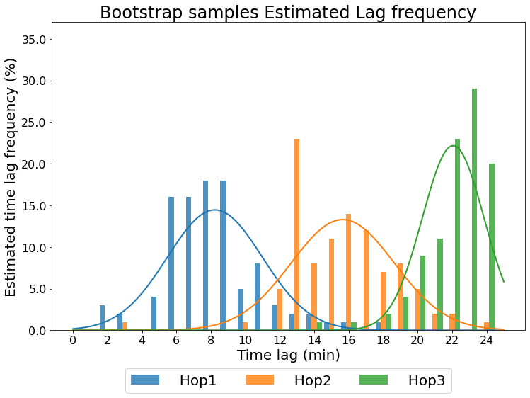
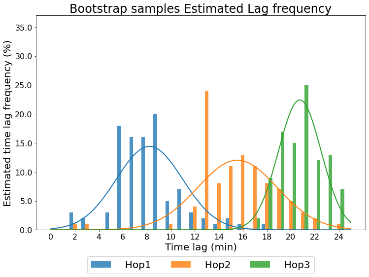

# TE-propagation
Time Delay Estimation of Traffic Congestion Propagation based on Transfer Entropy


## Prerequisite

### RTransferEntropy
When calculating transferentropy, we use R package '[RTransferEntropy](https://github.com/cran/RTransferEntropy)'
```R
install.packages("RTransferEntropy")
```

### rpy2
R package is binded with python using '[rpy2](https://github.com/rpy2/rpy2)'
```python
pip install rpy2
```

</br>

## Tutorial code 
Simulation data and tutorial code is included [Simulation]('https://github.com/yongkyung-oh/TE-propagation/blob/main/Simulation.ipynb')

`core` contains key functions to estimate time lag with transfer entropy and bootstrap 

```python
get_boot(x, y, lag=None, n_boot=100, plot=True, title=None, raw=None, save=None, curve=None):
'''
    x,y: source and target time series 
    n_boot: the number of bootstrap
    plot: bool, return figure output
    title: figure title
    raw: comparison value (e.g. raw value without normalization)
    save: figure save path
    curve: if true, return fitted curve info
'''
```

function `get_boot` return bootstrap estimation of time lag between two time series with organized plot,




We can estimate the mean and standard deviation of estimate time lag distribution using Bootstrap.

</br>

## Real data example
Suggested algorithm can be applied multi-hop path in the traffic network as follow 



In this case there are 5 paths exist:
- path 1
<p align="center"></p>

- path 2
<p align="center"></p>

- path 3
<p align="center"></p>

- path 4
<p align="center"></p>

- path 5
<p align="center"></p>


</br>

## Reference
```
Behrendt, S., Dimpfl, T., Peter, F. J., & Zimmermann, D. J. (2019). RTransferEntropy—Quantifying information flow between different time series using effective transfer entropy. SoftwareX, 10, 100265.
```
