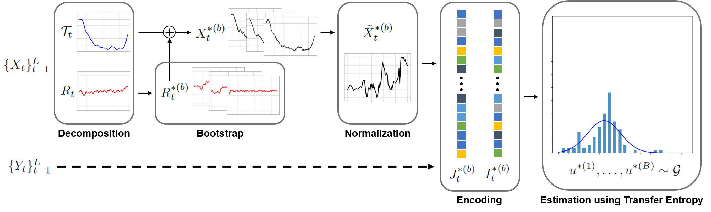
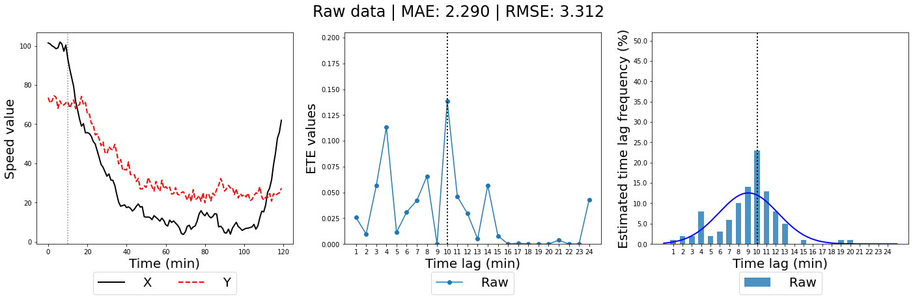
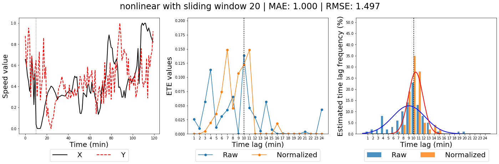
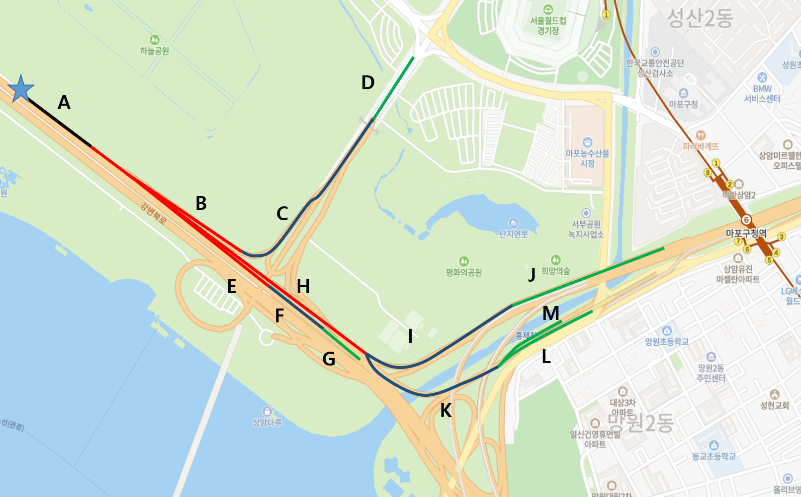
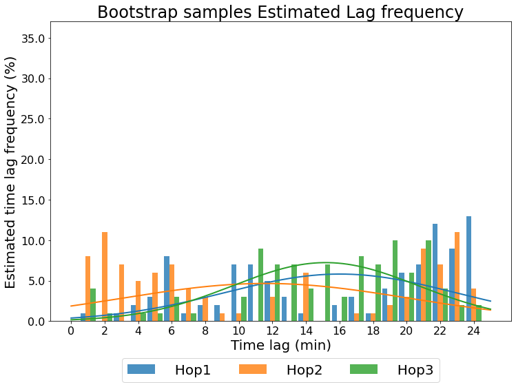
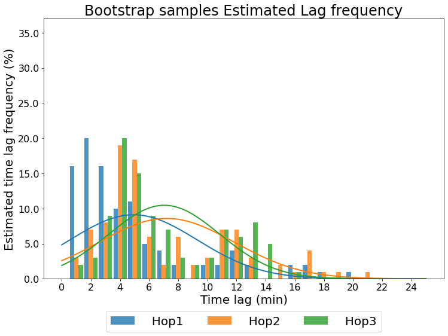
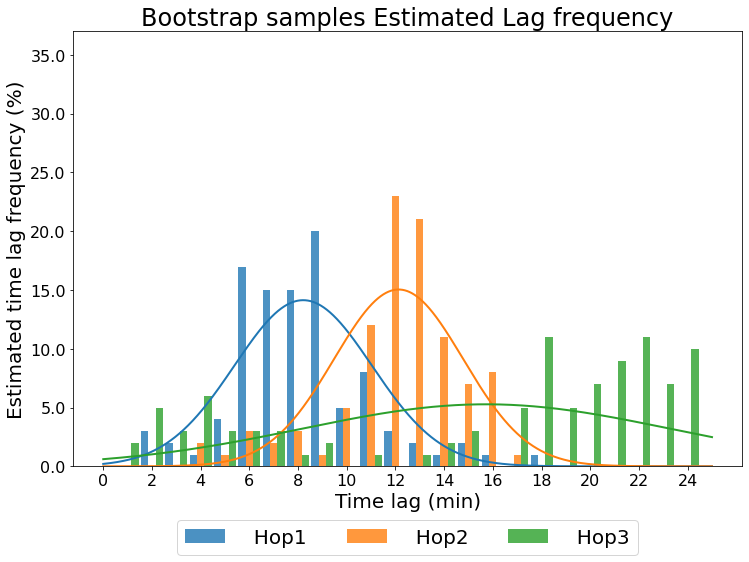
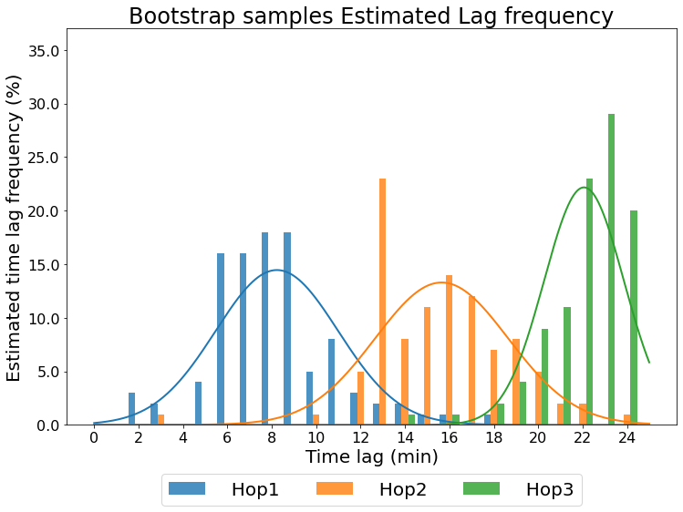
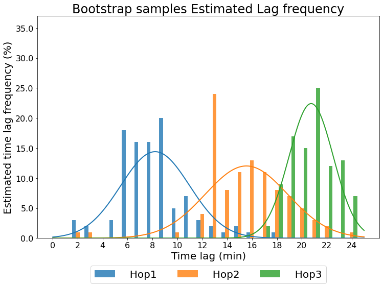

# Time delay estimation of traffic congestion propagation due to accidents based on statistical causality

> **TL;DR:** This repository estimates the **time delay** of **traffic congestion propagation** caused by traffic accidents using **transfer entropy** and **statistical causality**. Lag-specific transfer entropy with sliding-window nonlinear normalization reveals the causal relationship between adjacent roads, and **Markov bootstrap** quantifies the uncertainty of the time delay estimator. Validated on simulated data and real GPS navigation trajectory data from South Korea.

**Authors:** YongKyung Oh, JiIn Kwak, Sungil Kim
**Venue:** Electronic Research Archive (AIMS), vol. 31, no. 2, pp. 691-707, 2023
**DOI:** [10.3934/era.2023034](https://www.aimspress.com/article/doi/10.3934/era.2023034)
**Project page:** https://yongkyung-oh.github.io/TransferEntropy-Propagation/

**Keywords:** transfer entropy, statistical causality, time delay estimation, traffic congestion propagation, Markov bootstrap
**Corresponding author:** Sungil Kim (sungil.kim@unist.ac.kr)

### Earlier versions (preprints)
- Oh, Y., Kwak, J., Lee, J., & Kim, S. (2021). Time Delay Estimation of Traffic Congestion Based on Statistical Causality. [[OpenReview]](https://openreview.net/pdf?id=UMQ4PFd35i)
- Oh, Y., Kwak, J., Lee, J., & Kim, S. (2021). Time Delay Estimation of Traffic Congestion Propagation based on Transfer Entropy. [[arXiv:2108.06717]](https://arxiv.org/abs/2108.06717)

## Overview


## Abstract
Obtaining accurate time delay estimates is important in traffic congestion analysis because they can be used to address fundamental questions regarding the origin and propagation of traffic congestion. However, estimating the exact time delay during congestion is a challenge owing to the complex propagation process between roads and high uncertainty regarding the future behavior of the process. To aid in accurate time delay estimation during congestion, we propose a novel time delay estimation method for the propagation of traffic congestion due to traffic accidents using lag-specific transfer entropy (TE). Nonlinear normalization with a sliding window is used to effectively reveal the causal relationship between the source and target time series in calculating the TE. Moreover, Markov bootstrap techniques were adopted to quantify the uncertainty in the time delay estimator. To the best of our knowledge, the proposed method is the first to estimate the time delay based on the causal relationship between adjacent roads. The proposed method was validated using simulated data as well as real user trajectory data obtained from a major GPS navigation system applied in South Korea.

## Method


## Prerequisite

Transfer entropy is computed with the R package '[RTransferEntropy](https://github.com/cran/RTransferEntropy)', bound to Python via '[rpy2](https://github.com/rpy2/rpy2)'.
```R
install.packages("RTransferEntropy")  # in R
```
```python
pip install rpy2  # in shell
```

## Tutorial code
`core` contains key functions to estimate time lag with transfer entropy and bootstrap.

```python
get_boot(x, y, lag=None, n_boot=100, plot=True, title=None, raw=None, save=None, curve=None):
'''
    x,y: source and target time series
    n_boot: the number of bootstrap
    plot: bool, return figure output
    title: figure title
    raw: comparison value (e.g. raw value without normalization)
    save: figure save path
    curve: if true, return fitted curve info
'''
```

The function `get_boot` returns the bootstrap estimation of the time lag between two time series with an organized plot.




We can estimate the mean and standard deviation of the estimated time lag distribution using bootstrap.
Simulation data and tutorial code are included in '[Simulation](https://github.com/yongkyung-oh/TE-propagation/blob/main/Simulation.ipynb)'.

## Real data example
The suggested algorithm can be applied to a multi-hop path in the traffic network as follows.



In this case there are 5 paths:

- path 1: [A, B, C, D] 
- path 2: [A, E, F, G] 
- path 3: [A, H, I, J] 
- path 4: [A, H, K, M] 
- path 5: [A, H, K, L] 

## Citation
If you use this work, please cite the published paper:

```bibtex
@article{oh2023timedelay,
  title   = {Time delay estimation of traffic congestion propagation due to accidents based on statistical causality},
  author  = {Oh, YongKyung and Kwak, JiIn and Kim, Sungil},
  journal = {Electronic Research Archive},
  volume  = {31},
  number  = {2},
  pages   = {691--707},
  year    = {2023},
  doi     = {10.3934/era.2023034}
}
```

## Reference
```
Behrendt, S., Dimpfl, T., Peter, F. J., & Zimmermann, D. J. (2019). RTransferEntropy—Quantifying information flow between different time series using effective transfer entropy. SoftwareX, 10, 100265.
```

## License
Released under the [MIT License](LICENSE).
